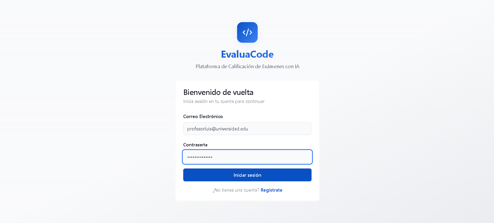
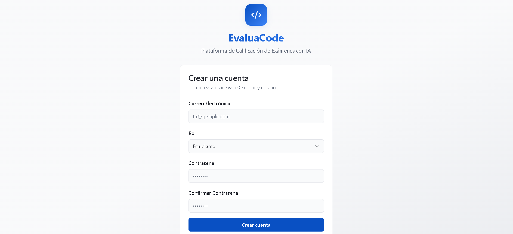
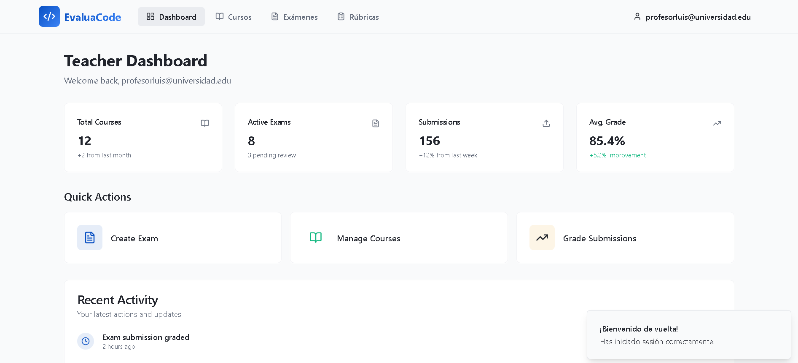
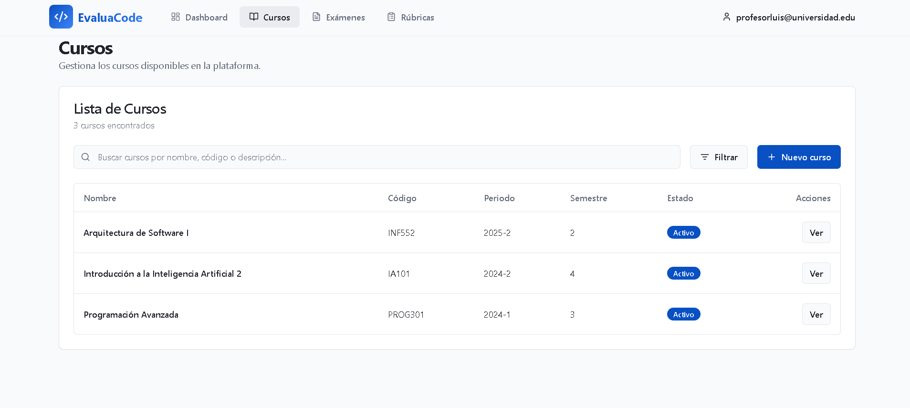
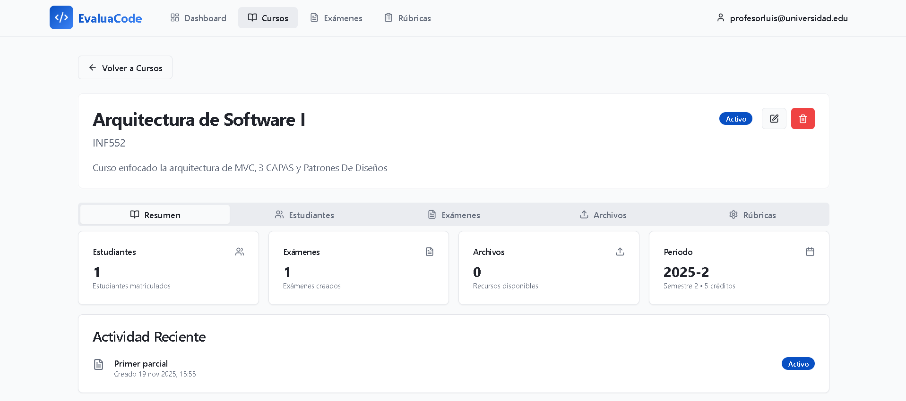
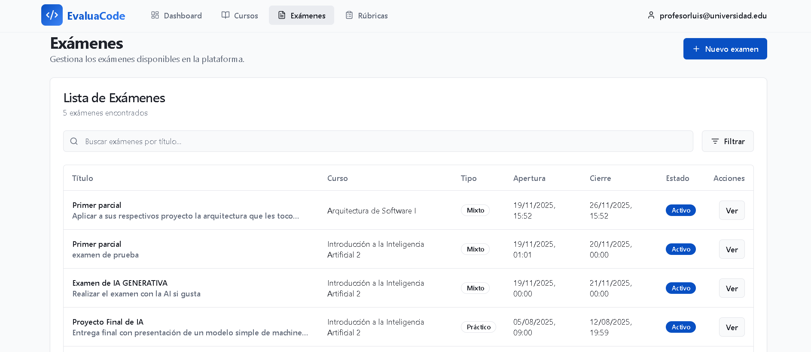
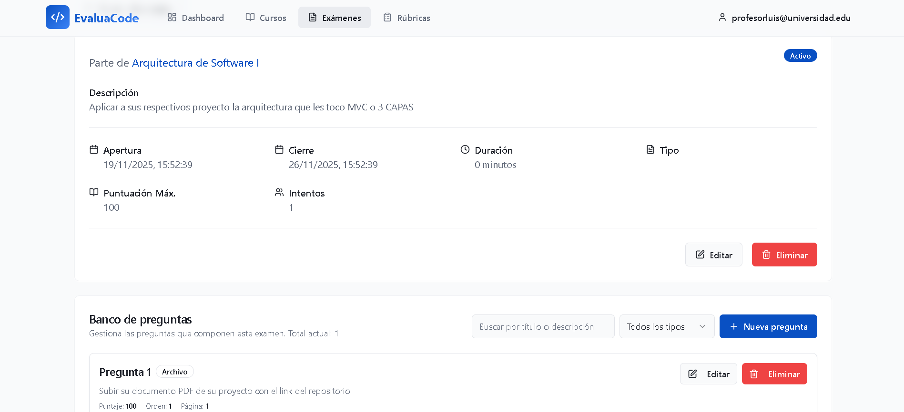
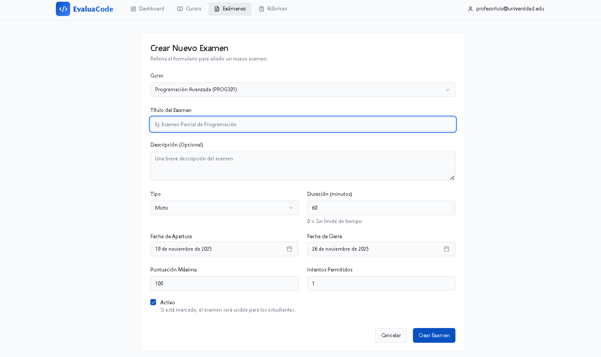
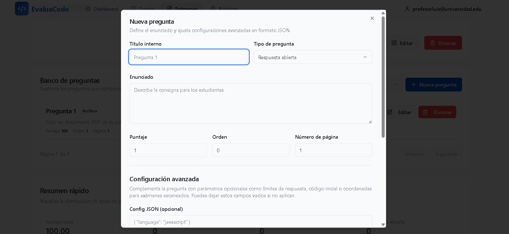
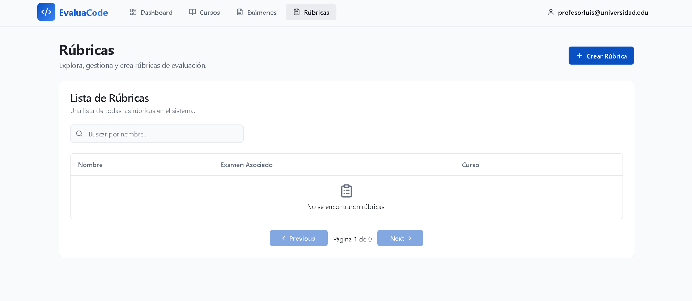

# EvaluaCode Frontend

AI-powered exam grading platform - Modern SPA built with React, TypeScript, and Vite.

## 🚀 Quick Start

### Prerequisites
- Node.js 20+ LTS
- pnpm (recommended) or npm

### Installation
```bash
# Install dependencies
pnpm install

# Configure environment variables
cp .env.example .env
# Edit .env with your API base URL

# Start development server
pnpm dev
```

### Available Scripts
```bash
pnpm dev          # Start development server
pnpm build        # Build for production
pnpm preview      # Preview production build
pnpm lint         # Run ESLint
```

## 🏗️ Architecture

### Technology Stack
- **Framework**: React 18 + TypeScript
- **Build Tool**: Vite
- **Styling**: TailwindCSS + shadcn/ui
- **Routing**: React Router v6
- **State Management**: Zustand
- **Data Fetching**: React Query + Axios
- **Forms**: React Hook Form + Zod


```

## 🔐 Authentication

The app uses JWT-based authentication with automatic token refresh:

1. **Access Token**: Short-lived (15 min), stored in localStorage
2. **Refresh Token**: Long-lived (7 days), stored in localStorage
3. **Automatic Refresh**: Interceptor handles token refresh on 401 errors


## 🎨 Design System

### Color Palette
- **Primary**: Deep blue/indigo for trust and professionalism
- **Success**: Emerald green for positive actions
- **Warning**: Amber for alerts
- **Destructive**: Red for errors

### Key Design Tokens
```css
--primary: Deep blue (HSL: 217 91% 40%)
--success: Emerald green (HSL: 160 84% 39%)
--gradient-primary: Blue-to-indigo gradient
--shadow-elegant: Subtle elevation shadow
```

## 📦 State Management

### Zustand Stores
- **Auth Store**: User session, tokens, role
  - Persisted to localStorage
  - Auto-hydrates on app load


### Error Handling
- Centralized error handling in API client
- Toast notifications for user-facing errors
- Automatic logout on auth failure

## 🎯 Key Features

### Implemented
- ✅ Authentication (login, register, logout)
- ✅ Role-based routing (admin, docente, estudiante)
- ✅ Dashboard with role-specific content
- ✅ Courses listing with search
- ✅ Exams listing with status badges
- ✅ Responsive navigation layout
- ✅ System health monitoring


## 📱 Responsive Design

The app is fully responsive with breakpoints:
- Mobile: < 768px
- Tablet: 768px - 1024px
- Desktop: > 1024px

## 🌐 Environment Variables

```env
VITE_API_BASE_URL=http://localhost:3000  # Backend API URL
VITE_USE_MOCK_DATA=false                 # Enable mock data for development
```

## 🚀 Deployment

```bash
# Build for production
pnpm build

# Preview production build locally
pnpm preview
```

The `dist/` folder contains the production-ready static files.

## 📝 Code Style

- ESLint + Prettier configured
- TypeScript strict mode enabled
- Component naming: PascalCase
- File naming: PascalCase for components, kebab-case for utilities

## 🤝 Contributing

1. Follow the established patterns
2. Use semantic tokens from design system
3. Write TypeScript with proper types
4. Test authentication flows thoroughly
5. Update README for new features

## Datos de prueba

🔑 Credenciales para probar login:
Administrador:
Email: admin@evaluacode.com
Password: Admin123!

Docentes:

Email: profesorluis@universidad.edu
Password: SecurePass123!
Email: profesoraana@universidad.edu
Password: SecurePass123!

Estudiantes:

Email: mariana.estudiante@universidad.edu
Password: Student123!

Email: carlos.estudiante@universidad.edu
Password: Student123!

Email: sofia.estudiante@universidad.edu
Password: Student123!

## Manual de usuario

imagen de login 




imagen de dashboard 


imagen de cursos 





imagen de examenes 








imagen de perfil 